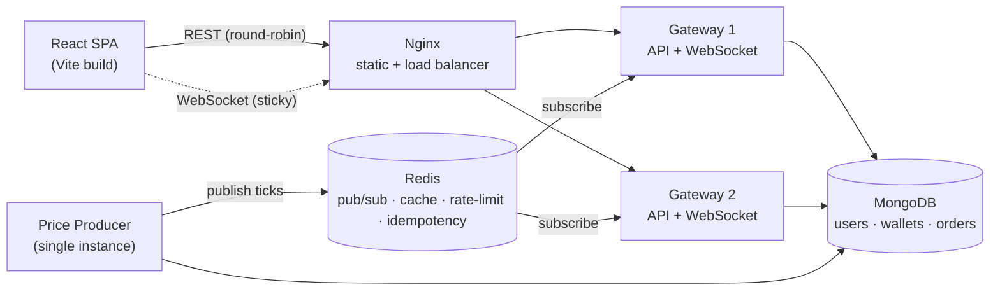

# Crest — Real-Time Paper-Trading Platform

Crest is a **simulated stock-trading web app**: a virtual INR wallet, live-ticking
NSE-style prices, market & limit orders, a portfolio with live P&L, a watchlist,
and a simulated Razorpay wallet flow — in a polished dark-theme UI that runs from
phones to desktop.

Under the hood it's built as a **real-time distributed system**, not a CRUD app:
a WebSocket price feed, Redis pub/sub + caching, rate limiting, concurrency-safe
money handling, and a horizontally-scaled deployment behind an Nginx load balancer.

**Stack:** MongoDB · Express · React (Vite) · Node · Redis · Socket.IO · Nginx · Docker

---

## Architecture



**Why this shape:** a single **producer** owns the price simulation and publishes
each tick to Redis, so every load-balanced **gateway** delivers the *same* feed to
its clients — you can scale the API/WebSocket tier horizontally without clients
seeing divergent prices. Gateways are stateless (JWT auth), so Nginx round-robins
REST across them; WebSockets are pinned per-client with `ip_hash`.

---

## System-design highlights

| Concern | How Crest handles it |
|---|---|
| **Real-time prices** | Server **pushes** ticks over **Socket.IO** (JWT-authed) — no client polling. |
| **Pub/Sub fan-out** | The producer publishes to **Redis**; each gateway subscribes and fans out to its own sockets. |
| **Caching** | Latest market snapshot cached in Redis; new socket connections get it instantly. |
| **Rate limiting** | **Redis sliding-window** limiter — auth (20 / 15 min per IP) and orders (30 / min per user); returns `429` + `Retry-After`. |
| **Concurrency safety** | Wallet moves use **atomic guarded updates** (`$gte` conditions) — verified 40 concurrent buys never overspend. |
| **Idempotency** | `Idempotency-Key` on order placement — retries replay the first result instead of double-filling. |
| **Atomic IDs** | Order/transaction ids come from an atomic Mongo counter (`$inc`), not a race-prone max-scan. |
| **Horizontal scaling** | Producer / gateway split via a `ROLE` env; **Nginx** balances 2 gateways in Docker Compose. |
| **Auth & isolation** | JWT + bcrypt; every query scoped to `userId` so accounts never see each other's data. |

---

## Project structure

```
Crest/
├── docker-compose.yml          full stack: nginx + 2 gateways + producer + redis + mongo
├── server/
│   ├── Dockerfile
│   └── src/
│       ├── index.js            entrypoint (ROLE = all | producer | gateway)
│       ├── seed.js             demo data + id counters
│       ├── config/             db.js, redis.js
│       ├── models/             mongoose schemas
│       ├── services/           auth.js (jwt/bcrypt), trade.js (atomic fills)
│       ├── middleware/         auth.js, rateLimit.js, idempotency.js
│       ├── market/             market.js (sim), producer.js (ticks), realtime.js (socket.io)
│       ├── routes/             api.js, auth.js
│       └── utils/              ids.js (atomic counter)
└── client/
    ├── Dockerfile              multi-stage build → Nginx (serves app + load-balances)
    ├── nginx.conf
    └── src/
        ├── main.jsx, App.jsx, index.css
        ├── context/            auth, store (WebSocket), ui (modals)
        ├── lib/                api, socket, format, selectors
        ├── components/         Sidebar, TopBar, modals, charts
        └── screens/            Dashboard, Watchlist, Portfolio, Orders, Wallet, StockDetail
```

---

## Run it

### Option A — Docker Compose (the full load-balanced stack)
Brings up Nginx + 2 gateways + producer + Redis + Mongo:
```bash
docker compose up -d --build
```
Open **http://localhost:8080**. Every response carries an `X-Served-By` header so
you can watch requests round-robin between the two gateways. Stop it with
`docker compose down` (add `-v` to wipe the demo data volume).

### Option B — Local dev (hot reload)
Prerequisites: Node 18+, a local **MongoDB** (`:27017`) and **Redis** (`:6379`).
Start Redis quickly with `docker run -d -p 6379:6379 redis:7-alpine`.

```bash
# terminal 1 — backend (producer + gateway in one process)
cd server && npm install && cp .env.example .env && npm run seed && npm run dev

# terminal 2 — frontend
cd client && npm install && npm run dev
```
Open **http://localhost:5173** (Vite proxies `/api` and `/socket.io` to `:4000`).

### Accounts
Sign up (new accounts start with **₹1,00,000** virtual funds) or use the seeded
demo account — **`demo@crest.app` / `demo123`**.

---

## Configuration (`server/.env`)
| Var | Default | Notes |
|---|---|---|
| `ROLE` | `all` | `all` \| `producer` \| `gateway` (split for scaling) |
| `MARKET_HOURS` | `auto` | `auto` (real NSE hours) \| `always` (24/7 demo) \| `closed` |
| `TICK_MS` | `1400` | simulation tick interval |
| `MONGO_URI` / `REDIS_URL` | local | connection strings |
| `JWT_SECRET` | — | set a long random string in production |

---

## API
| Method | Path | Purpose |
|---|---|---|
| POST | `/api/auth/register` · `/login` | create account / sign in → JWT (rate-limited) |
| GET | `/api/auth/me` | current user |
| GET | `/api/state` | full snapshot for the signed-in user |
| GET | `/api/prices` | shared live price feed |
| POST | `/api/orders` | place a market/limit order (rate-limited, idempotent) |
| POST | `/api/orders/:id/cancel` | cancel a pending order |
| POST | `/api/wallet` | add / withdraw funds |
| POST / DELETE | `/api/watchlist[/:symbol]` | add / remove a symbol |

Live prices are delivered over the **Socket.IO** `tick` event, not REST polling.
Every endpoint except `/api/auth/register` and `/api/auth/login` requires an
`Authorization: Bearer <token>` header and acts only on the signed-in user's data.
